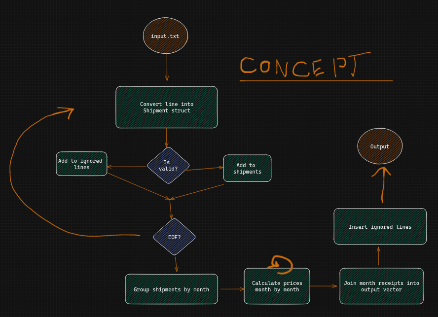

# Discount Calculation Module
| Table Of Contents        | link        |
| -------------------------| ----------- |
| About 🔍                  |  [here](#1) |
| Running and Debuging 🛠️   |  [here](#2) |

## About 🔍 
Vinted - Backend Homework Assignment, [description](https://gist.github.com/vintedEngineering/7a24d2bb2ef4189447c6b938604ab030)

This is high level diagram of the module:

## Running and Debuging 🛠️ 
| Script                       | Description                           |
| ---------------------------- | ------------------------------------- |
| `cargo build`                | Compile package                       |
| `cargo run`                  | Run package (default ./input.txt)     |
| `cargo run ./test.txt`       | Run package                           |
| `cargo add crate`            | Add crate (dep)                       |
